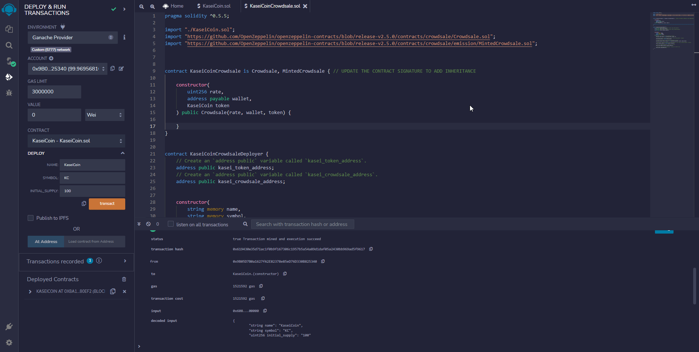

# Unit 21: Martian Token Crowdsale

## Evaluation Evidence
&nbsp;

### Step 1: Create the KaseiCoin Token Contract
&nbsp;  

&nbsp;
### Step 2: Create the KaseiCoin Crowdsale Contract  
&nbsp;  
  
&nbsp;  
### Step 3: Create the KaseiCoin Deployer Contract
&nbsp;  

&nbsp;
### Step 4: Deploy and Test the Crowdsale on a Local Blockchain
&nbsp;
#### Step 4.1 Deploying the KaseiCoin contract
&nbsp;

&nbsp;
#### Step 4.2 Deploying the KaseiCoin Crowdsale
&nbsp;

&nbsp;
>* Before the tokens can be bought by other ETH accounts, the wallet that holds the CrowdSale contract needs to be given the role of a minter.  
>* Before buying the tokens, in the Remix IDE, toggle the Account to the one that wishes to purchase the tokens.
>* Copy the ETH address of this account and paste it in the beneficiary address field of the buyTokens method of the Crowdsale contract.
>* It can be seen from the video below the wallet holding the Crowdsale Contract is crediting with the ETH amounts that the beneficiaries purchased the tokens for.    

&nbsp;

